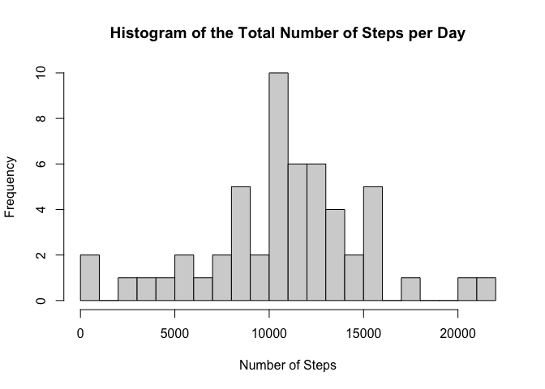
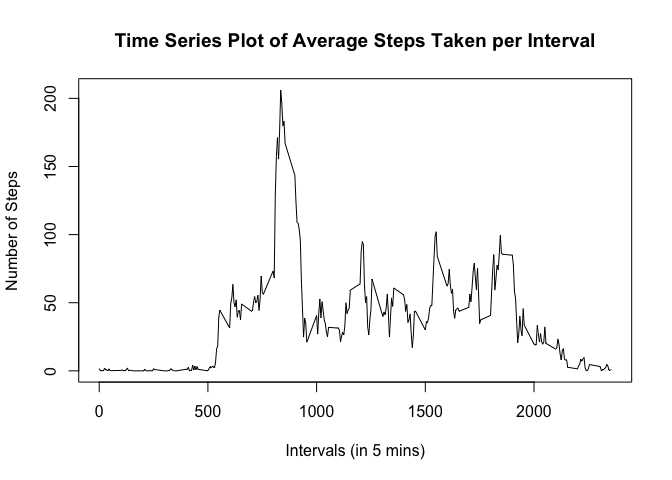
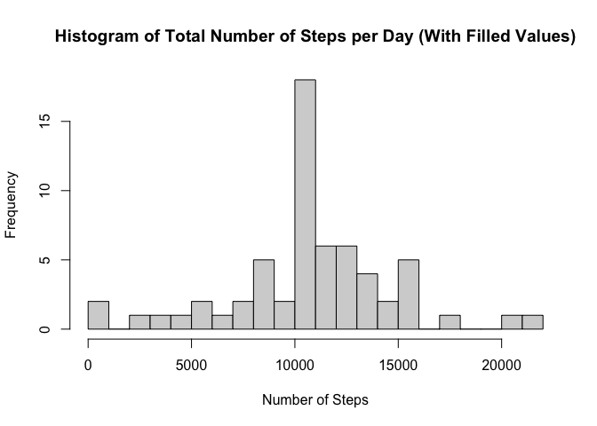
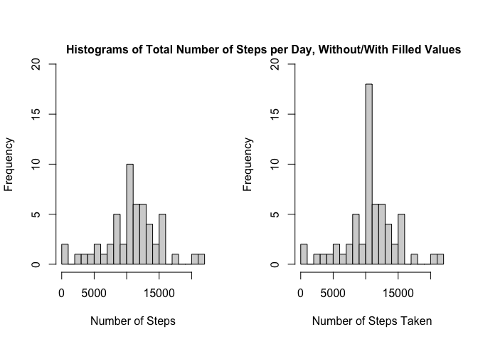
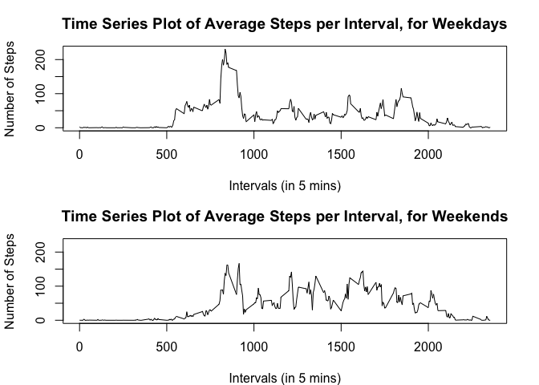

## Loading and preprocessing the data
### 1. Code for reading in the dataset and/or processing the data

Download and save the activity.csv:


```r
if (!file.exists("./activity.csv")) {
  
  # download the data
  file_url <- "https://d396qusza40orc.cloudfront.net/repdata%2Fdata%2Factivity.zip"
  file_name <- "activity.zip"
  download.file(file_url, file_name, method = "curl")
  
  # unzip file
  unzip(file_name)
  
}

  # save variable and tidy data
  activity_data <- read.csv('./activity.csv',
  colClasses=c("numeric", "Date", "numeric"))
```

## What is mean total number of steps taken per day?
### 2. Histogram of the total number of steps taken each day


```r
data <- activity_data[!(is.na(activity_data$steps)), ]
total_Steps_Day <- aggregate(steps ~ date, data, sum)
hist(total_Steps_Day$steps, breaks=20, xlab="Number of Steps", 
     main="Histogram of the Total Number of Steps per Day")
```

<!-- -->

### 3. Mean and median number of steps taken each day


```r
library(dplyr)
```

```
## Warning: replacing previous import 'lifecycle::last_warnings' by
## 'rlang::last_warnings' when loading 'pillar'
```

```
## Warning: replacing previous import 'lifecycle::last_warnings' by
## 'rlang::last_warnings' when loading 'tibble'
```

```
## 
## Attaching package: 'dplyr'
```

```
## The following objects are masked from 'package:stats':
## 
##     filter, lag
```

```
## The following objects are masked from 'package:base':
## 
##     intersect, setdiff, setequal, union
```

```r
total_Steps_Summary <- summarise(total_Steps_Day, mean_Steps=mean(total_Steps_Day$steps),
                               median_Steps=median(total_Steps_Day$steps))
```
## What is the average daily activity pattern?
### 4. Time series plot of the average number of steps taken


```r
mean_Steps_Interval <- aggregate(steps ~ interval, data, mean)
plot(x=mean_Steps_Interval$interval, y=mean_Steps_Interval$steps, type="l",
     main="Time Series Plot of Average Steps Taken per Interval",
     ylab="Number of Steps", xlab="Intervals (in 5 mins)")
```

<!-- -->

### 5. The 5-minute interval that, on average, contains the maximum number of steps


```r
mean_Steps_Interval[grep(max(mean_Steps_Interval$steps), mean_Steps_Interval$steps), ]
```

```
##     interval    steps
## 104      835 206.1698
```

## Imputing missing values
### 6. Code to describe and show a strategy for imputing missing data
Strategy is to replace the NAs with the mean from that 5 min interval across the measured days.


```r
filled_Data <- activity_data
for(x in 1:17568) {
    if(is.na(filled_Data[x, 1])==TRUE) {
        filled_Data[x, 1] <- mean_Steps_Interval[mean_Steps_Interval$interval %in% filled_Data[x, 3], 2]
    }
}
```


### 7. Histogram of the total number of steps taken each day after missing values are imputed

```r
filled_Total_Steps_Day <- aggregate(steps ~ date, filled_Data, sum)

hist(filled_Total_Steps_Day$steps, breaks=20, xlab="Number of Steps", 
     main="Histogram of Total Number of Steps per Day (With Filled Values)")
```

<!-- -->


```r
filled_Steps_Summary <- summarise(filled_Total_Steps_Day, 
                                 mean_Steps=mean(filled_Total_Steps_Day$steps), 
                                 median_Steps=median(filled_Total_Steps_Day$steps))  

rbind(total_Steps_Summary, filled_Steps_Summary)
```

```
##   mean_Steps median_Steps
## 1   10766.19     10765.00
## 2   10766.19     10766.19
```

```r
# Pictures are worth a thousand words
par(mfrow = c(1, 2))
hist(total_Steps_Day$steps, breaks=20, xlab="Number of Steps", 
     ylim=c(0, 20), main=NULL)
hist(filled_Total_Steps_Day$steps, breaks=20, xlab="Number of Steps Taken", 
     ylim=c(0, 20), main=NULL)
mtext("Histograms of Total Number of Steps per Day, Without/With Filled Values",
      adj=0.95, font=2)
```

<!-- -->
Higher with filled values, because we filled in the missing values.

## Are there differences in activity patterns between weekdays and weekends?
### 8. Panel plot comparing the average number of steps taken per 5-minute interval across weekdays and weekends


```r
days_Data <- filled_Data
days_Data$days <- weekdays(days_Data$date)
days_Data$weekday <- as.character(rep(0, times=17568))
for(x in 1:17568) {
    if(days_Data[x, 4] %in% c("Saturday", "Sunday")) {
        days_Data[x, 5] <- "weekend"
    } else {
        days_Data[x, 5] <- "weekday"
    }
}
days_Data$weekday <- factor(days_Data$weekday)

weekday_Data <- days_Data[days_Data$weekday=="weekday", ]
weekend_Data <- days_Data[days_Data$weekday=="weekend", ]

weekday_Mean <- aggregate(steps ~ interval, weekday_Data, mean)
weekend_Mean <- aggregate(steps ~ interval, weekend_Data, mean)

par(mfrow=c(2, 1), mar=c(4, 4.1, 3, 2.1))
plot(weekday_Mean$interval, weekday_Mean$steps, type="l",
     main="Time Series Plot of Average Steps per Interval, for Weekdays",
     xlab="Intervals (in 5 mins)", ylab="Number of Steps", ylim=c(0, 230))
plot(weekend_Mean$interval, weekend_Mean$steps, type="l",
     main="Time Series Plot of Average Steps per Interval, for Weekends",
     xlab="Intervals (in 5 mins)", ylab="Number of Steps",ylim=c(0, 230))
```

<!-- -->

